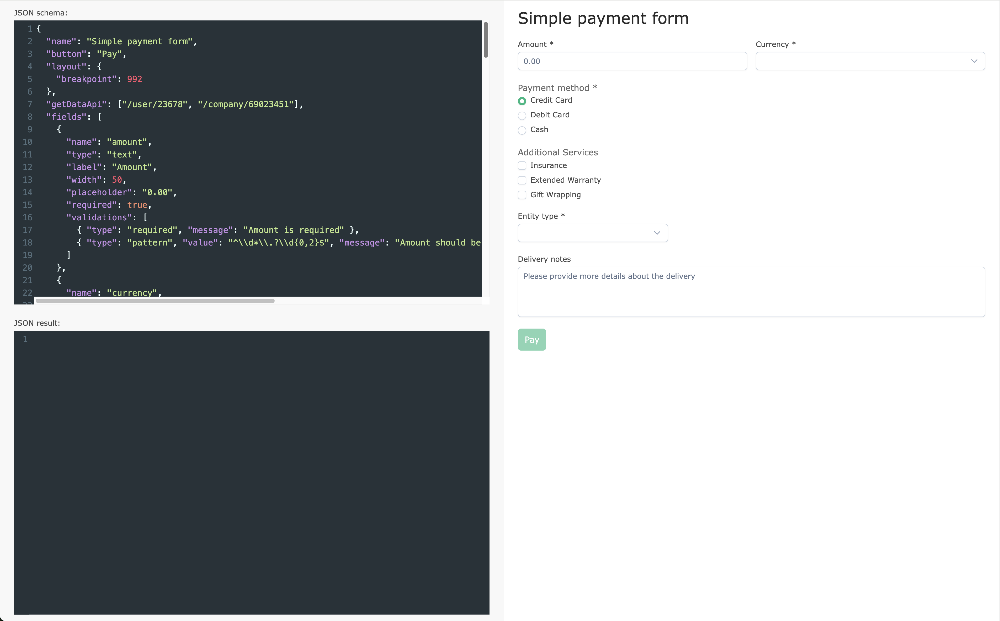

# DynamicFormBuilder

This project was generated using [Angular CLI](https://github.com/angular/angular-cli) version 19.1.0.

## About

A single-page application designed to dynamically generate reactive Angular forms from JSON inputs. 
Upon form submission, the form's values are displayed in a read-only JSON format within a text editor at the bottom. 
The submit button remains disabled until the form is valid.


### Input

On the top left side of the page, an input field is found where users can enter a JSON structure to define the form layout. This JSON can specify input fields, nested groups, and dependencies. 
Whenever the JSON is modified, the form will automatically re-render to reflect the updated structure.

#### JSON structure

##### JSON state includes the following properties:
| Name |  Type  |  Default | Required | Description |
| ----- | -----  | -------- | -------- | ----------- |
| name  | `string` | null     | true     | Name of the form, used as title of the result form |
| button | `string` | 'Submit' | true    | Label of the form button, which submit the form    |
| getDataApi | `Array<string>` | null | false | List of APIs request paths, which can be used to populate form fields on load |
| fields | `Array<FormField>` | [] | true | Array of all form fields, which represents the form controls |
| layout | `Layout` | null | false | Layout configuration to customize the UI of the generated form |


##### FormField configuration:
| Name | Type | Default | Required | Description |
| ---- | ---- | ------- | -------- | ----------- |
| name | `string` | null | true | Control name in the result form. |
| type | `FieldType` | null | true | Control type, which manage the input type of the html element. |
| label | `string` | null | true | Control label on the top of the form control. |
| width | `Width` | null | true | Form control width, when place the control in the form layout on rows and columns. |
| placeholder | `string` | null | false | Placeholder of the form control. |
| required | `boolean` | null | false | Manage form control as required - add * to the form label on UI. |
| lookupApi | `string` | null | false | API request url to be used to fetch options of the form control. Each option must be in format `{ name: string; code: string }`. Applicable for radio buton groups, checkbox groups, dropdown. If not provided, use `options` property instead. |
| options | `Array<OptionItem>` | null | false | List of control options - applicable for radio groups, checkbox groups and dropdown control. |
| value | `any` | null | false | Default value of the form control, when loading the form (optional) |
| visibleIf | `VisibleCheck` | null | false | Use to provide visibility dependencies between form fields. |
| validations | `Array<Validation>` | [] | false | List of validation rules for the form control. |
| fields | `Array<FormField>` | null | false | This property is required when the form control represents nested FormGroup with form controls and `fieldType` is "group". |

`FieldType` supports:
  * "text"
  * "textarea"
  * "dropdown"
  * "checkbox"
  * "radio"
  * "textCustomValidation"
  * "group"
  "group" is used for nested Form group in the form.

`Width` accepts:
  * 25
  * 33.33
  * 50
  * 66.66
  * 75
  * 100

Form control widths can be configured as full width (100%), half width for two columns per row (50%), one-third width for three columns per row (33.33%), one-quarter width for four columns per row (25%), and so on.

`OptionItem` represents single option for dropdown, radio input group and checkbox group. It includes label (string), value (string).

#### Supported API requests

##### Lookups
The application incorporates mock GET lookup API calls to simulate external data dependencies, providing test data for field options:
  * '/currencies' - return simple list of currencies
  * '/payment-method' - return payment method options
  * '/additional-payment-options' - "insurance" | "extendedWarranty" | "giftWrap"
  * '/entity-types' - "INDIVIDUAL" | "BUSINESS"
  * '/insurance-types' - list of insurance types
  * '/travel-ins-reasons' - list of reasons, when user select insurance type travel
  * '/identification-types' - "PERSONAL_ID" | "PASSPORT"

##### Autofill
To demonstrate auto-fill of personal / business data, the following mocked API calls can be used:
  * '/user/23678' - return a Person object
  * '/company/69023451' - return a Company object

JSON examples can be found [here](/public/docs/examples).

### Form

Generated reactive form may includes different types of controls, nested form groups are supported too.
One or multiple form controls can be dynamically hidden or visible, depending of other form control values.
Form control validations can be dynamically changed depeding of other form control values.

#### Dynamic form control visibility
To manage dynamic visibility use `visibleIf` property of single field in the JSON input.
It accepts an object width following properties:
  * field: `string` (field name of source control)
  * value: `any` (value of source form control)
When the form detect changes on the source control value, it trigger checking of the target control visibility, depending of the value exact match the current source control value.

##### Sample input JSON
Control name "groupIndividual" is a nested form group, which will be visible, when control with name "entityType" has value "INDIVIDUAL".

```json
{
    "name": "groupIndividual",
    "type": "group",
    "label" : "Personal Data",
    "width": 100,
    "visibleIf": {
        "field": "entityType",
        "value": "INDIVIDUAL"
    },
    "fields" : [
        {
          "name": "firstName",
          "type": "text",
          "label": "First name",
          "width": 33.33,
          "placeholder": "John",
          "required": true,
          "validations": [
          	{ "type": "required", "message": "First name is required", "when": { "field": "entityType", "value": "INDIVIDUAL" } },
          	{ "type": "minLength", "value": "2", "message": "First name should be at least 2 characters", "when": { "field": "entityType", "value": "INDIVIDUAL" } }
          ]
        }
    ]
}
```

#### Dynamic form control validation

To manage dynamic validations, use the optional `when` of type `ValidationCheck` property in `validations` property of single field - object with params:
  * field - string (source control name)
  * value - any (source control value)

When the cource control value is changing, the reactive form triggers the validation checks for the current (target) form control.

##### Supported validation types:

###### Standard validators
  * `required` - Angular built in "required" validatior
  * `requiredTrue` - Angular built in "RequiredTrue" validator
  * `minLength` - Angular built in "MinLength" validator
  * `maxLength` - Angular built in "MaxLength" validator
  * `min` - Angular built in "min" validator
  * `max` - Angular built in "max" validator
  * `email` - Angular built in "email" validator
  * `pattern` - Angular built in "pattern" RegEx validator

###### Custom (application defined) validators  
  * `ssnCheck` - Application build in "SSN" validator
  * `passport` - Application build in "Passport" validator
  * `vat` - Application build in "VAT" validator

##### Example
Control with name "lastName" will have required validation and minLength(2) validation, only when the form control with name "entityType" has exact value "INDIVIDUAL".

```json
{
    "name": "lastName",
    "type": "text",
    "label": "Last name",
    "width": 33.33,
    "placeholder": "Doe",
    "required": true,
    "validations": [
        { "type": "required", "message": "Last name is required", "when": { "field": "entityType", "value": "INDIVIDUAL" } },
        { "type": "minLength", "value": "2", "message": "Last name should be at least 2 characters", "when": { "field": "entityType", "value": "INDIVIDUAL" } }
    ]
}
```

### Output

Upon submitting a validated form, the form values are recalculated and output as JSON, displayed in a read-only format on the bottom left side. The result includes only non-empty values. If a nested form group contains no values, the entire group is excluded from the output.

## Dependencies
  * Bootstrap - version 5.3.3 or upper
  * PrimeNg - version 19.0.9 or upper
  * PrimeNg Themes - version 19.0.9 or upper
  * CodeMirror - 5.65.18

## Development server

You need to install all packages first:

```bash
npm install
```

To start a local development server, run:

```bash
ng serve
```

Once the server is running, open your browser and navigate to `http://localhost:4200/`.

## Building

To build the project run:

```bash
ng build
```

This will compile your project and store the build artifacts in the `dist/` directory. By default, the production build optimizes your application for performance and speed.

## Running unit tests

To execute unit tests with the [Karma](https://karma-runner.github.io) test runner, use the following command:

```bash
ng test
```


## Examples
Form generation (example 1)


Validations and dynamic visibilty


Form result on submit


Form generation (example2)


Form generation (mobile)
| mobile view part1 | mobile view part2 |
:----: | :----:
 | 

Validations and visibility (example 2)


Form result (example 2)


